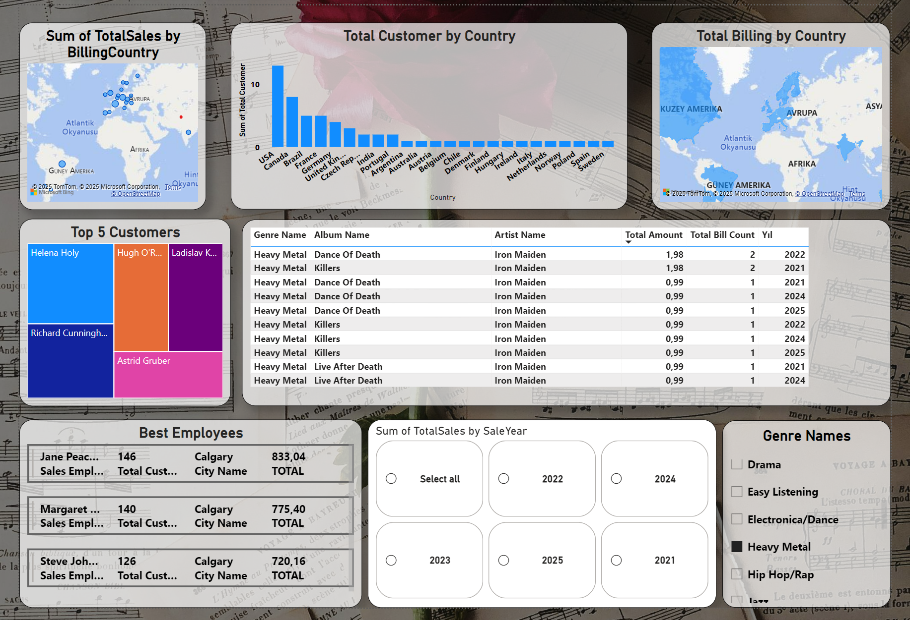

# ChinookDB

# Project Overview
This repository contains SQL-based analysis of the Chinook database, a sample database for learning SQL queries and analysis. It demonstrates various SQL operations and outputs, including filtering, grouping, and joining tables.

# How It Works
This repository uses the Chinook database, which is a sample database for music store management. The analysis is conducted with SQL queries, and output is provided in `.rpt` formats.

## Power BI Görselleri

### Görsel 1: Genel Bakış

Bu görsel, raporun ana sayfasını ve genel yapısını göstermektedir.

### Görsel 2: Genre Filtreleme

Bu görselde, **Genre Names** tablosundan "Heavy Metal" seçildiğinde, 2. tabloda yalnızca "Heavy Metal" türünde müzik yapan sanatçıların bilgileri gösterilmektedir.

### Görsel 3: Gelir Dağılımı

Bu görsel, her ülke bazında toplam faturalandırma sayılarını detaylı şekilde göstermektedir.

### Görsel 4: En İyi 5 Müşteri

### Görsel 5: Genre ve Yıl Filtrelemesi

Bu görselde, seçilen **Genre** ve **Yıl** filtrelerine göre ilgili müzik türü ve yıllara ait veriler detaylandırılmıştır.

