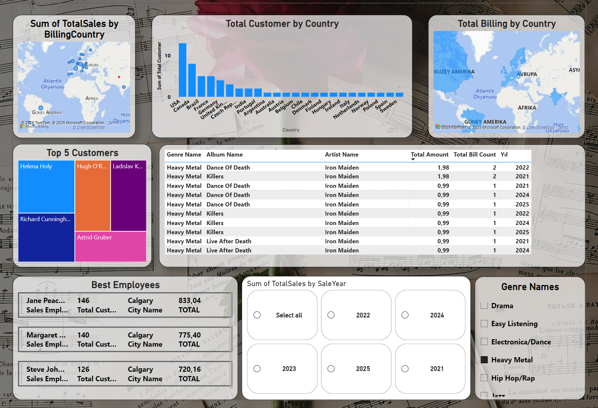

# ChinookDB

# Music Store Analytics & Recommendation System

An end-to-end data project built on the Chinook music store database. The project covers SQL-based business analysis, interactive Power BI dashboards, and a deployed machine learning recommendation system — combining data analysis, visualization, and deployment in a single pipeline.

[Live App]: Streamlit Music Recommendation App (https://chinookdb-cx9k9otd4gbsnbqgvh5y4g.streamlit.app/)

# Motivation

The goal was to simulate a real-world analytics workflow: starting from raw relational data, extracting business insights through SQL, communicating findings through dashboards, and finally building a user-facing recommendation product. Each layer of the project mirrors tasks commonly required in data science roles.

# How It Works
This repository uses the Chinook database, which is a sample database for music store management. The analysis is conducted with SQL queries, and output is provided in `.rpt` formats.

# What Was Built

1. SQL Business Analysis

Queried the relational Chinook database to answer key business questions:

Which countries generate the most revenue?
Who are the top 5 customers by lifetime spend?
Which genres and artists drive the most sales?
How do sales vary across years and regions?

Techniques used: JOIN, GROUP BY, window functions, subqueries, aggregations.

# 2. Power BI Dashboard

Translated SQL findings into an interactive multi-page dashboard:

Revenue distribution by country
Top customers by total spend
Genre and year filtering for drill-down analysis
Artist performance by selected genre

# 3. Music Recommendation System (Deployed)

Built a collaborative filtering model using purchase history data to recommend songs to users based on similar listening patterns. Deployed as a live Streamlit web application.

Technologies: Python (Pandas, Scikit-learn), SQL, Power BI, Streamlit

Key Takeaways

Practiced translating business questions into SQL queries on a multi-table relational schema
Learned to bridge the gap between raw query output and stakeholder-ready visualizations
Deployed a working ML model as a web app, completing the full development-to-deployment cycle

## Power BI Visuals

### Visual 1: Overview

This visual shows the main page and the general structure of the report.

### Visual 2: Revenue Distribution

This visual provides detailed information about the total invoice counts per country.

### Visual 3: Top 5 Customers

This visual displays the top 5 customers with the highest revenue.

### Visual 4: Genre Filtering

In this visual, when "Heavy Metal" is selected from the **Genre Names** table, only the information of artists who produce "Heavy Metal" music is displayed in the second table.

### Visual 5: Genre and Year Filtering

In this visual, the selected **Genre** and **Year** filters highlight the corresponding data for the chosen music genres and years.

# Project Structure

ChinookDB/
├── ChinookDB.sql              # Database schema
├── DataCollection.sql         # Business analysis queries
├── MusicRec.ipynb             # Recommendation model development
├── MusicRecStreamlit.py       # Streamlit app
├── Chinook_PowerBI.pbix       # Power BI dashboard
└── images/                    # Dashboard screenshots

